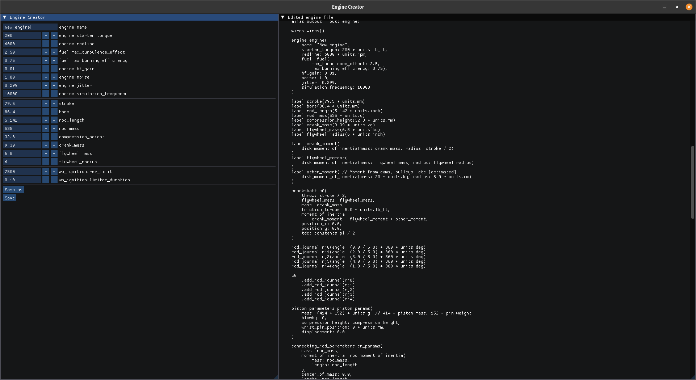

# Engine Creator

Tool for creating engines for AngeTheGreat's [Engine Simulator](https://github.com/ange-yaghi/engine-sim)

Can change values and units of template_engine.mr and save to file

Template engine is original engine from engine simulator: [engine file](https://github.com/ange-yaghi/engine-sim/blob/master/assets/engines/audi/i5.mr)

### How do I build it?

#### Linux
```
gh repo clone jotalamp/engine-creator -- --recurse-submodules 
mkdir build
cd build
cmake .. && make && make install && ../bin/test && ../bin/engine-creator
```

#### Windows
```
gh repo clone jotalamp/engine-creator -- --recurse-submodules 
mkdir build
cd build
cmake ..
```
Open solution in Visual Studio

### Screenshots

